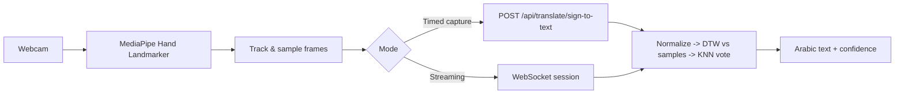

# Ishara (إشارة)

**Ishara** is an open platform for translating **Arabic Sign Language** into text. It tracks 3D hand landmarks from a webcam, stores community-contributed samples, and matches new signs against that library.

The project is in active early development. The current recognizer covers a small set of Arabic letters and is intended as a research and data-collection foundation, not a finished production translator.

## Features

- **3D hand tracking** — MediaPipe Vision extracts 21 landmarks per hand (63 values with depth), supporting one- or two-handed signs.
- **Two translation modes** — a timed **HTTP capture** for one-shot translation, and a streaming **WebSocket** pipeline for live, continuous translation.
- **Dialect-aware dictionary** — signs are recorded and matched per dialect (currently Syrian, Saudi, Egyptian, Lebanese, Iraqi, and Gulf).
- **DTW + KNN matching** — sequences are compared with Dynamic Time Warping and classified with a k-nearest-neighbors vote, which works well even with few samples per word.
- **Community recording** — authenticated recorders contribute new landmark sequences so the dataset can grow over time.
- **Browsable dictionary** — words, variants, and sample counts live in PostgreSQL and are exposed through the web app.

## How it works



This README stays at a product level. Full algorithmic and architectural detail — normalization formulas, the DTW/Sakoe-Chiba band, KNN voting, hold detection for live translation, database schema, and file-level responsibilities — lives in [`docs/PipelineProcess.md`](docs/PipelineProcess.md).

### Timed-capture translation

The user starts the camera and taps "translate." The client records a few seconds of hand motion, keeping only frames where the hands moved enough or 150 ms have passed (a heartbeat), then posts the landmark sequence to `POST /api/translate/sign-to-text`, scoped to a dialect:

```json
{
  "dialect": "سورية",
  "landmarksJson": [
    /* frames of hands of { x, y, z } */
  ]
}
```

The server normalizes each hand into a 126-D vector, matches it against cached samples for that dialect with DTW, and returns the best match from a 5-nearest-neighbor vote:

```json
{ "word": "hello", "arabicText": "مرحبا", "confidence": 85.5 }
```

If there are no usable samples for the dialect, the API returns 404.

### Live translation (WebSocket)

For continuous signing, a WebSocket session streams landmarks as they're captured. The server detects moments of stillness ("holds") to segment individual signs and match them against a hold-indexed trie as they happen, falling back to a sliding-window DTW match for signs without a clear hold. The session emits `partial`, `final`, or `idle` events as the user signs, instead of waiting for a single request/response round trip.

### How samples enter the library

An authenticated **sign recorder** captures a clip the same way translation does, labels it with Arabic text, a transliterated `word` id, dialect, category, and difficulty, then saves it via `POST /api/admin/signs/record`. Each sample is stored as a landmark sequence linked to a word and a dialect variant; translation never touches raw video, only these trajectories. Adding a sample invalidates that dialect's cache so the next translation picks it up.

## Roadmap

- **Hybrid recognition** — LSTM/Transformer models for data-rich words, with DTW + KNN retained for low-resource and newly added signs.
- **Native app** — a dedicated mobile/desktop client for recording and translating outside the browser.
- **Broader coverage** — more dialects, more gesture variants of the same word, and normalization for signer fatigue.

## Research and community

Ishara is meant to support **research** on Arabic Sign Language: few-shot recognition, dialect variation, hybrid DTW/neural pipelines, and related HCI topics. The dataset and code are structured so experiments can sit on top of the same collection and evaluation loop.

We intend to **collaborate with deaf associations** to collect authentic samples, review glosses, and expand coverage beyond the current letter set. Community contributions through the recorder remain welcome alongside that partnership.

If you are a researcher, educator, or organization working with Arabic Sign Language, [open an issue](https://github.com/mnoNoor/ishara/issues) or use the in-app contact page.

## Tech stack

| Layer     | Stack                                             |
| --------- | ------------------------------------------------- |
| Client    | React, Vite, Tailwind CSS, MediaPipe Tasks Vision |
| Server    | Node.js, Express, TypeScript                      |
| Database  | PostgreSQL, Drizzle ORM                           |
| Real-time | WebSocket                                         |
| Auth      | JWT (access + refresh cookies)                    |

See [`docs/ProjectStructure.md`](docs/ProjectStructure.md) for the full file layout.

## Getting started

**Requirements:** Node.js, Docker (for PostgreSQL), and a camera for translation/recording.

```bash
# 1. Start PostgreSQL
docker compose up -d

# 2. Server
cd server
cp .env.example .env   # edit secrets if needed
npm install
npm run db:migrate
npm run dev            # http://localhost:8080

# 3. Client (another terminal)
cd client
npm install
npm run dev            # http://localhost:5173
```

By default the client talks to `http://localhost:8080/api`. Override with `VITE_API_URL` if you change the API origin.

Production build from the repo root:

```bash
npm run build
npm start
```

## License

[Apache License 2.0](LICENSE)
