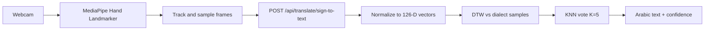

# Ishara (إشارة)

**Ishara** is an open platform for translating **Arabic Sign Language** into text. It tracks 3D hand landmarks from a webcam, stores community-contributed samples, and matches new signs against that library.

The project is in active early development. The current recognizer covers a small set of Arabic letters and is intended as a research and data-collection foundation, not a finished production translator.

## Features

- **3D hand tracking** — MediaPipe Vision extracts 21 landmarks per hand (63 values with depth), with support for one- or two-handed signs.
- **Sign-to-text translation** — Sequences of landmarks are compared to stored samples using Dynamic Time Warping (DTW) and a k-nearest-neighbors (KNN) vote.
- **Dialect-aware dictionary** — Signs can be recorded and matched per dialect (currently: Syrian, Saudi, Egyptian, Lebanese, Iraqi, and Gulf).
- **Community recording** — Authenticated recorders contribute new landmark sequences so the dataset can grow over time.
- **Browsable dictionary** — Words, variants, and sample counts are stored in PostgreSQL and exposed through the web app.

## How translation works

Translation is a **timed capture**, not a continuous stream. The user starts the camera, then taps “translate.” The client records about **three seconds** of hand motion, sends the landmark sequence to the API, and shows the best matching Arabic gloss plus a confidence score.



### 1. Capture and tracking (browser)

MediaPipe **Hand Landmarker** (float16, GPU when available) runs in `VIDEO` mode on every animation frame. It detects up to **two hands**, each with **21 3D landmarks** (`x`, `y`, `z`).

While recording:

- Hands are assigned to **stable slots** by tracking wrist position across frames so left/right identity does not flip mid-sign.
- After capture ends, slots are ordered using MediaPipe **handedness votes** (left vs right).
- Frames are **not** stored at full camera rate. A frame is kept only if the hands moved enough (mean landmark change above a threshold) **or** 150 ms have passed since the last kept frame (heartbeat). That keeps sequences shorter without dropping the shape of the sign.
- If no hand motion is recorded, translation is aborted with an error.

The payload is `landmarksJson`: an array of frames, each frame an array of up to two hands, each hand an array of landmark points.

### 2. Request (HTTP)

The client posts to `POST /api/translate/sign-to-text`:

```json
{
  "dialect": "سورية",
  "landmarksJson": [/* frames of hands of { x, y, z } */]
}
```

The body is validated (non-empty dialect, at least one frame). Matching is **scoped to that dialect** so a Syrian sample is not compared against an Egyptian variant of the same word.

### 3. Normalization (server)

Each hand is turned into a **63-dimensional** vector (21 points × 3 coordinates):

- Subtract the **wrist** so position in the camera frame does not matter.
- Divide by the distance from wrist to **middle-finger MCP** so hand size and camera distance do not matter.
- Missing hands (one-handed signs) become a zero vector.

The two hands are concatenated into a **126-dimensional** vector per frame. The clip becomes a sequence of those vectors.

### 4. Matching: DTW + KNN

Stored samples for the dialect are loaded (cached in memory for about an hour, up to 500 samples per dialect). Sequences with fewer than three frames are skipped.

**Dynamic Time Warping (DTW)** measures how similar two sequences are when they have different lengths or speeds. A Sakoe–Chiba band (~20% of the longer sequence) limits how far the warp path can stray. The DTW cost is divided by the path length so longer signs are not penalized just for having more frames.

**K-nearest neighbors (K = 5)** then votes:

1. Rank all samples by DTW distance.
2. Take the five closest.
3. Each neighbor votes for its Arabic gloss with weight `1 / (distance + ε)`.
4. The gloss with the highest total weight wins.

**Confidence** combines how much of the vote that gloss received with how close the neighbors were (`voteShare × exp(-averageDistance)`), then is returned as a percentage (0–100).

The API responds with `{ word, arabicText, confidence }`. The UI shows the Arabic text, the Latin identifier, confidence, and a short history of recent results.

If there are no usable samples for that dialect, the API returns 404.

DTW is a deliberate choice for this stage: it handles signs of different durations and works with **few samples per word**. That property will remain important even after neural models are added.

### How samples enter the library

Recognition quality depends on the sample set. An authenticated **sign recorder** captures a clip the same way, labels it with Arabic text (transliterated to a `word` id), dialect, category, and difficulty, then saves it via `POST /api/admin/signs/record`. Each sample stores the landmark sequence as JSON, linked to a **word** and a **dialect variant**. Translation never uses raw video—only these landmark trajectories.

## Roadmap

### Recognition models

The long-term plan is a **hybrid recognizer**:

- **LSTM** or **Transformer** models for words that have enough training samples.
- **DTW + KNN** kept for low-resource words and new signs that do not yet have a large sample set.

This keeps the system usable while the dataset is still sparse, and lets data-rich signs move to sequence models without dropping coverage of rare vocabulary.

### Real-time translation (WebSocket)

Translation is currently a request/response HTTP call after a timed capture. The next step is a **WebSocket** pipeline so landmarks can stream continuously and results can update live.

### Native app

A dedicated mobile (or desktop) client is planned so recording and translation can happen outside the browser, with camera access and a simpler experience for contributors and learners.

## Research and community

Ishara is meant to support **research** on Arabic Sign Language: few-shot recognition, dialect variation, hybrid DTW/neural pipelines, and related HCI topics. The dataset and code are structured so experiments can sit on top of the same collection and evaluation loop.

We intend to **collaborate with deaf associations** to collect authentic samples, review glosses, and expand coverage beyond the current letter set. Community contributions through the recorder remain welcome alongside that partnership.

If you are a researcher, educator, or organization working with Arabic Sign Language, [open an issue](https://github.com/mnoNoor/ishara/issues) or use the in-app contact page.

## Tech stack

| Layer | Stack |
| --- | --- |
| Client | React, Vite, Tailwind CSS, MediaPipe Tasks Vision |
| Server | Node.js, Express, TypeScript |
| Database | PostgreSQL, Drizzle ORM |
| Auth | JWT (access + refresh cookies) |

## Getting started

**Requirements:** Node.js, Docker (for PostgreSQL), and a camera for translation/recording.

```bash
# 1. Start PostgreSQL
docker compose up -d

# 2. Server
cd server
cp .env.example .env   # edit secrets if needed
npm install
npm run db:migrate
npm run dev            # http://localhost:8080

# 3. Client (another terminal)
cd client
npm install
npm run dev            # http://localhost:5173
```

By default the client talks to `http://localhost:8080/api`. Override with `VITE_API_URL` if you change the API origin.

Production build from the repo root:

```bash
npm run build
npm start
```

## License

[Apache License 2.0](LICENSE)
