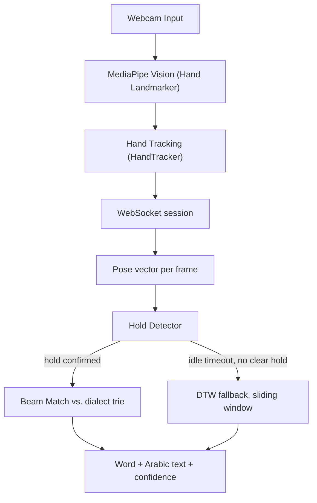
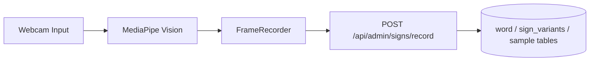

# Ishara Pipeline Process

Technical reference for how a sign becomes text in Ishara: capture, transport, matching, and storage. For product-level features and setup, see the [README](../README.md). For the file/directory layout, see [ProjectStructure.md](ProjectStructure.md).

## Table of Contents

1. [Architecture Overview](#1-architecture-overview)
2. [Translation Pipeline (Timed Capture, Disabled)](#2-translation-pipeline-timed-capture-disabled)
3. [Live Translation Pipeline (WebSocket, Current)](#3-live-translation-pipeline-websocket-current)
4. [Sample Recording Pipeline](#4-sample-recording-pipeline)
5. [Component Reference](#5-component-reference)
6. [Database Schema](#6-database-schema)
7. [Data Structures](#7-data-structures)
8. [Matching Algorithms (DTW & KNN)](#8-matching-algorithms-dtw--knn)
9. [Error Handling](#9-error-handling)
10. [Performance Notes](#10-performance-notes)
11. [Future Work](#11-future-work)

---

## 1. Architecture Overview

**Current: live translation over WebSocket**



**Disabled, kept for reference: one-shot HTTP translation**

The `/translate` route and `Translate.tsx` are currently commented out in `client/src/App.tsx`, so this flow isn't reachable from the app while the live pipeline above is developed further. The endpoint (`POST /api/translate/sign-to-text`) and its DTW + KNN matching logic still exist server-side and are documented in full in [Section 2](#2-translation-pipeline-timed-capture-disabled), in case it's re-enabled or repurposed later.

**Sample recording (always active, independent of translation mode)**



---

## 2. Translation Pipeline (Timed Capture, Disabled)

> **Status: disabled.** The `translate` route and the `Translate.tsx` component are commented out in `client/src/App.tsx` while the live-translation flow (Section 3) is developed further. The backend endpoint and matching algorithm below are unchanged and still work — this section is kept as a technical reference for whenever the flow is re-enabled.

### 2.1 Capture & tracking (client)

- Webcam access via `Video.tsx` and `getUserMedia()`.
- `VisionEngine.ts` + `HandLandmarker.ts` run MediaPipe Hand Landmarker in `VIDEO` mode: up to 2 hands, 21 landmarks each (x, y, z).
- `HandTracker.ts` keeps left/right identity stable across frames by tracking wrist position and confirming with MediaPipe's handedness votes, so a hand doesn't "flip" mid-sign.
- `FrameRecorder.ts` keeps a frame only if mean landmark motion exceeds a threshold, or 150 ms have passed since the last kept frame (a heartbeat) — this shortens the sequence without losing the sign's shape.
- `FrameRecorder.ts` also strips each frame down to just the hand landmarks (see [Wire / matching format](#7-data-structures)) before it's sent as `landmarksJson`.

### 2.2 Request

`POST /api/translate/sign-to-text` is public (no auth). `validate.ts` middleware requires a non-empty, supported dialect and at least one valid frame.

```json
{
  "dialect": "سورية",
  "landmarksJson": [
    [
      [{ "x": 0.5, "y": 0.4, "z": 0.1 }, "..."],
      [{ "x": 0.7, "y": 0.3, "z": 0.2 }, "..."]
    ],
    "..."
  ]
}
```

### 2.3 Normalization

`translateService.ts → normalizeHand()` turns each hand's 21 landmarks into a 63-D vector:

1. Take the wrist (landmark 0) as the origin.
2. Scale by the wrist-to-middle-MCP (landmark 9) distance, so hand size and camera distance don't matter.
3. A missing hand becomes 63 zeros.

```
normalized_x = (x - wrist_x) / scale
scale = distance(wrist, middle_mcp)
```

`frameToVector()` concatenates both hands into a 126-D vector per frame.

### 2.4 Sample loading & caching

Samples for the requested dialect are loaded from PostgreSQL and cached in memory (`NodeCache`, 1-hour TTL, up to 500 samples per dialect). Sequences shorter than 3 frames are skipped as unreliable.

### 2.5 Matching & confidence

The cached samples are scored against the query with DTW and voted on with KNN — see [Matching Algorithms](#8-matching-algorithms-dtw--knn) for the full method. Confidence combines the vote and the distance:

```
confidence = voteShare * exp(-averageDistance) * 100   // 0-100
```

### 2.6 Response

```json
{ "word": "hello", "arabicText": "مرحبا", "confidence": 85.5 }
```

`Translate.tsx` displays the Arabic text and confidence and appends the result to translation history.

---

## 3. Live Translation Pipeline (WebSocket, Current)

This is the only active translation mode right now. `liveTranslateService.ts` (`LiveTranslateSession`) streams landmarks over a WebSocket instead of a single timed HTTP request, reusing the same capture and normalization steps as above.

- **Hold Detector** (`holdDetector.ts`) — flags moments where hand motion drops below a threshold, marking likely word boundaries.
- **Hold Beam Matcher** (`signTrie.ts`) — indexes samples by their hold sequence in a trie; at each hold, it attempts to match the frames accumulated so far and can return a result mid-sign.
- **DTW fallback** — for signs without a clean hold, a sliding window of frames is matched against templates with DTW, triggered after `IDLE_RESET_MS = 1200 ms` of no motion.

```typescript
type LiveTranslateEvent =
  | { type: "partial"; word: string; arabicText: string; confidence: number }
  | { type: "final"; word: string; arabicText: string; confidence: number }
  | { type: "idle" };
```

**Processing loop**, per incoming frame: run the hold detector → if a hold is found, attempt beam matching and emit `partial` on a hit → if the idle timeout is reached, emit `final` (or reset) → otherwise fall back to DTW on the sliding window.

---

## 4. Sample Recording Pipeline

1. **Record** — `SignRecorder.tsx` uses the same capture/tracking flow as translation.
2. **Label** — the recorder types the Arabic text; a Latin `word` id is derived automatically by transliteration. `dialect`, `category`, and `difficulty` are currently sent with fixed defaults (single dialect, `general`, `beginner`) — there's no picker for them in the current UI, though the schema already supports per-dialect variants and the `category`/`difficulty` enums (see the note in [Database Schema](#6-database-schema)).
3. **Submit** — `POST /api/admin/signs/record`, JWT-authenticated, normalized into the same 126-D vectors.
4. **Store** — across the `word`, `sign_variants`, and `sample` tables (see [Database Schema](#6-database-schema)).
5. **Invalidate** — the affected dialect's cache is cleared so the next translation request picks up the new sample.

---

## 5. Component Reference

| File                      | Responsibility                                                                  |
| ------------------------- | ------------------------------------------------------------------------------- |
| `VisionEngine.ts`         | Coordinates MediaPipe models and the per-frame inference loop                   |
| `VisionFileset.ts`        | Loads/caches MediaPipe model + WASM files; handles GPU/CPU fallback             |
| `HandLandmarker.ts`       | Wraps MediaPipe Hand Landmarker in `VIDEO` mode                                 |
| `HandTracker.ts`          | Keeps left/right hand identity stable across frames                             |
| `FrameRecorder.ts`        | Motion- and heartbeat-based frame sampling                                      |
| `DrawingLayer.ts`         | Canvas skeleton overlay for debugging/feedback                                  |
| `translateService.ts`     | Normalization and DTW/KNN orchestration (`findBestMatch()`), cache invalidation |
| `liveTranslateService.ts` | WebSocket session lifecycle, hold coordination, event emission                  |
| `signTrie.ts`             | Builds the hold-indexed trie and matches against it                             |
| `dtwMatcher.ts`           | DTW with Sakoe-Chiba banding                                                    |
| `holdDetector.ts`         | Detects stillness/hold events                                                   |
| `poseVector.ts`           | Converts pose landmarks to vectors (for future pose-based matching)             |
| `frameDistance.ts`        | Euclidean distance between frame vectors                                        |

---

## 6. Database Schema

Defined with Drizzle ORM in `server/src/db/schema.ts`.

**Enums**

| Enum            | Values                                                                                              |
| --------------- | --------------------------------------------------------------------------------------------------- |
| `category`      | general, greetings, numbers, family, colors, animals, food, emotions, body_parts, clothing, weather |
| `difficulty`    | beginner, intermediate, advanced                                                                    |
| `user_role`     | admin, sign_recorder, user                                                                          |
| `dominant_hand` | right, left                                                                                         |

**`word`** — one row per Arabic gloss.

| column       | type                                  | notes                                                                         |
| ------------ | ------------------------------------- | ----------------------------------------------------------------------------- |
| `id`         | serial PK                             |
| `word`       | varchar(255)                          | transliterated/Latin id                                                       |
| `arabicText` | text, unique                          |
| `category`   | `category` enum, default `general`    | schema-only for now — not yet used by matching, filtering, or the recorder UI |
| `difficulty` | `difficulty` enum, default `beginner` | same — reserved, not wired up yet                                             |
| `createdAt`  | timestamp                             |

**`user`**

| column                               | type                                                            | notes |
| ------------------------------------ | --------------------------------------------------------------- | ----- |
| `id`                                 | uuid PK                                                         |
| `name`, `email` (unique), `password` |
| `profileImage`                       | text, default `""`                                              |
| `role`                               | `user_role` enum, default `user` — admin / sign_recorder / user |
| `dominantHand`                       | `dominant_hand` enum, nullable                                  |
| `createdAt`                          | timestamp                                                       |

**`sign_variants`** — a word's rendering in a given dialect.

| column                                    | type                                                                                                            | notes |
| ----------------------------------------- | --------------------------------------------------------------------------------------------------------------- | ----- |
| `id`                                      | serial PK                                                                                                       |
| `signId`                                  | FK → `word.id`                                                                                                  |
| `dialect`                                 | varchar(50)                                                                                                     |
| `videoUrl`                                | text, default `""`                                                                                              |
| `imageUrls`                               | jsonb `string[]`                                                                                                |
| `sampleCount`                             | integer, default 0                                                                                              |
| `rightTranslations` / `wrongTranslations` | integer, default 0 — running tally of translation outcomes for this variant (not covered elsewhere in this doc) |
| `createdAt`                               | timestamp                                                                                                       |
| —                                         | unique on `(signId, dialect)`; index on `signId`                                                                |

**`sample`** — one recorded landmark clip.

| column          | type                                    | notes |
| --------------- | --------------------------------------- | ----- |
| `id`            | serial PK                               |
| `variantId`     | FK → `sign_variants.id`                 |
| `recordedBy`    | FK → `user.id`                          |
| `landmarks`     | jsonb, typed as `Sequence`              |
| `recordingDate` | timestamp                               |
| —               | indexed on `variantId` and `recordedBy` |

**`sign_recorders`** — per-user, per-dialect recording stats.

| column        | type                          | notes |
| ------------- | ----------------------------- | ----- |
| `id`          | serial PK                     |
| `userId`      | FK → `user.id`                |
| `dialect`     | varchar(50)                   |
| `sampleCount` | integer, default 0            |
| `createdAt`   | timestamp                     |
| —             | unique on `(userId, dialect)` |

---

## 7. Data Structures

### Client-side vision frame (`VisionEngine` output, `client/src/components/vision/types.ts`)

```typescript
type Landmark = {
  x: number;
  y: number;
  z: number;
  visibility?: number;
  presence?: number;
};

type HandData = { landmarks: Landmark[]; worldLandmarks: Landmark[] };

type Frame = {
  timestamp: number;
  hands: { left: HandData | null; right: HandData | null };
  pose: { landmarks: Landmark[]; worldLandmarks: Landmark[] } | null;
  face: { landmarks: Landmark[]; blendshapes: FaceBlendshape[] } | null;
};

type Sequence = Frame[];
```

This is the full per-frame detection output: both hands (screen-space **and** 3D world landmarks), a body pose, and a face with blendshape scores. Only the hand landmarks are used today — pose and face are captured but not yet fed into normalization, DTW, or storage.

### Wire / matching format

`FrameRecorder` reduces the above to just the hand landmarks before a sequence is sent to the server or written to `sample.landmarks`:

```typescript
type WireLandmark = { x: number; y: number; z?: number };
type WireFrame = WireLandmark[][]; // WireFrame[0] = hand 1, WireFrame[1] = hand 2 (up to 21 points each)
type WireSequence = WireFrame[]; // this is `landmarksJson` / the stored `Sequence`

type NormalizedVector = number[];
// 126 elements: [0-62] hand 1, [63-125] hand 2 (zeros if a hand is absent)

type TranslationResult = {
  word: string; // Latin identifier, e.g. "hello"
  arabicText: string; // Arabic gloss, e.g. "مرحبا"
  confidence: number; // 0-100
};

interface DtwTemplate {
  variantId: number;
  word: string;
  arabicText: string;
  vectors: number[][]; // normalized 126-D vectors per frame
}

interface SegmentedTemplate {
  variantId: number;
  word: string;
  arabicText: string;
  holds: number[][]; // pose vector captured at each detected hold, in order
}
```

---

## 8. Matching Algorithms (DTW & KNN)

> There are two separate DTW implementations in the codebase: `translateService.ts` (below), used by the disabled one-shot endpoint together with KNN voting, and `dtwMatcher.ts`, used as the live pipeline's fallback (Section 3) with no voting step and a fixed band radius (default 15) rather than a percentage of sequence length. The two aren't interchangeable — this section documents `translateService.ts`'s version.

### Dynamic Time Warping

DTW measures similarity between sequences that may differ in length or speed. A **Sakoe-Chiba band** (~20% of the longer sequence) restricts the warp path to a corridor around the diagonal, cutting complexity from O(n×m) to O(n×band) — important for live translation, where many templates are checked per hold. The raw cost is divided by path length so longer signs aren't penalized just for having more frames.

```
dtw(query, template, radius):
  n = length(query)
  m = length(template)
  band = max(radius, |n - m| + 1)

  prev = [0, inf, inf, ...]
  for i in 1..n:
    curr = [inf, inf, inf, ...]
    for j in max(1, i-band)..min(m, i+band):
      cost = distance(query[i-1], template[j-1])
      curr[j] = cost + min(prev[j], curr[j-1], prev[j-1])
    swap(prev, curr)

  return prev[m] / path_length   // normalized cost
```

### K-Nearest Neighbors

1. Sort all cached samples by normalized DTW distance.
2. Take the closest 5 (`DEFAULT_K = 5`).
3. Each neighbor votes for its word with weight `1 / (distance + eps)`.
4. Sum weights per word; the highest total wins.

This combination works with very few samples per word, needs no training step, and stays explainable — the winning neighbors can always be inspected — which is why it's kept as a fallback even as neural models are added (see [Future Work](#11-future-work)).

---

## 9. Error Handling

These apply to the HTTP endpoints (translation and recording):

- **400** — invalid dialect, empty landmark sequence, or missing fields (caught by validation middleware).
- **404** — no samples found for the requested dialect.
- **500** — database, cache, or unexpected processing failures.

The live (WebSocket) session has no HTTP status codes — it emits a `translate:error` event with a message instead (e.g. missing dialect data, a frame processing exception).

---

## 10. Performance Notes

- **Client** — capture runs at 30-60 FPS; MediaPipe models take ~500 ms to load (cached after); inference is ~100-200 ms per frame (GPU-accelerated when available).
- **Server** — DTW is typically <50 ms per sample; KNN voting is <5 ms for k=5; a typical translation request completes in ~200-500 ms end to end.
- **Database** — indexed on `(dialect, wordId)`; Drizzle ORM manages the connection pool.

---

## 11. Future Work

- Sentence-level data: a planned table for full sentences, alongside the existing word/variant/sample structure.
- Hybrid recognition: LSTM/Transformer models for high-resource words, with DTW + KNN kept for the long tail and newly added signs.
- Earlier, more granular partial results in the live pipeline (streaming holds are still coarse).
- Better handling of continuous signs that don't produce a clear hold.

Product-level roadmap items (native app, dialect/community coverage) are tracked in the [README](../README.md#roadmap).
